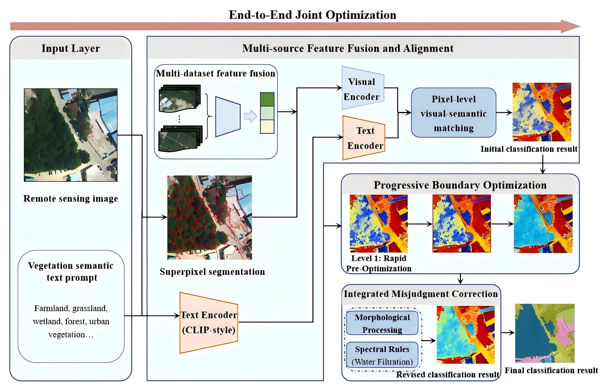

# RS-VegCLIP: Progressive boundary optimization for zero-shot fine-grained vegetation classification

## Environment

The experiments were conducted on a Dell Workstation with NVIDIA Quadro P5000 GPU and Windows 10.

**Crucial packages:**
- torch 1.10.0
- torchvision 0.11.0
- clip 1.0
- numpy 1.21.0
- opencv-python 4.5.0
- scikit-image 0.19.0
- scipy 1.7.0
- matplotlib 3.4.0
- pillow 8.0.0

## Data Acquisition
- LoveDA: [https://doi.org/10.48550/arXiv.2110.08733]
- AID: [https://doi.org/10.1109/TGRS.2017.2685945]
- EuroSAT: [https://doi.org/10.1109/JSTARS.2019.2918242]
- MLRSNet: [https://doi.org/10.1016/j.isprsjprs.2020.09.020]
- OPTIMAL31: [https://doi.org/10.1109/TGRS.2018.2864987]
- PatternNet: [https://doi.org/10.1016/j.isprsjprs.2018.01.004]
- RESISIC45: [https://doi.org/10.1109/JPROC.2017.2675998]
- RSICB128/RSICB256: [https://doi.org/10.3390/s20061594]
- WHURS19: [https://doi.org/10.1109/LGRS.2010.2055033]
- 2024EarthVQA: [https://doi.org/10.1609/aaai.v38i6.28357]

## Test
The configs can be modified in config.yaml.

## Note
This repository contains some source code and data used in research projects. Meanwhile, the manuscript is still under review, and the complete code and pre-trained model weights will be made public once the manuscript is published and the overall research is completed.